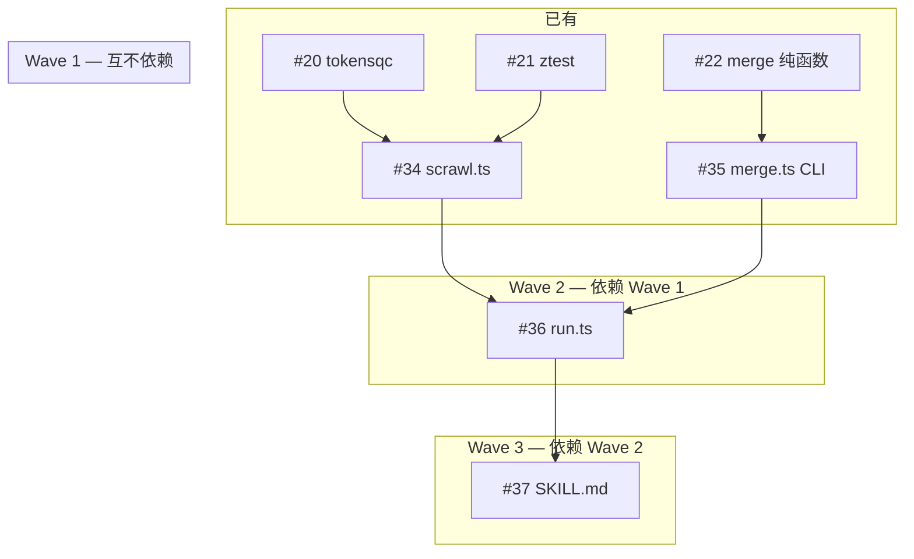

# Issue #24 实施计划

> 生成于 2026-06-25 grill-with-docs 审查后

## 子 Issue 依赖图



## Wave 1：scrawl.ts + merge.ts CLI（可并行）

### #34 scrawl.ts

| 文件 | 操作 | 内容 |
|------|------|------|
| `agent/pazi/src/extractors/types.ts` | 新增 | `SingleSourceOutput` 接口 |
| `agent/pazi/src/commands/scrawl.ts` | 新建 | CLI 入口 |

核心逻辑：

```typescript
// 1. 解析参数
const sourceId = process.argv[2];  // 位置参数
const headless = process.argv.includes("--headless");

// 2. 覆写 config
if (headless) process.env.PAZI_HEADLESS = "true";

// 3. 查 registry
const source = sources.find(s => s.id === sourceId);

// 4. 执行提取
const extractor = await source.run();
const start = Date.now();
const providers = await extractor.run();
const durationMs = Date.now() - start;

// 5. 写 raw JSON
const artifact = path.resolve(`data/extracts/raw-${sourceId}.json`);
await writeFile(artifact, JSON.stringify(providers, null, 2));

// 6. dispose
await extractor.dispose();

// 7. stdout JSON
const output: SingleSourceOutput = { mode: "single", source: sourceId, status: "success", count: providers.length, durationMs, artifact };
console.log(JSON.stringify(output));
```

错误处理：catch → `{ mode: "single", status: "error", error: { message, type: classifyError(e) } }` → exit 1。

### #35 merge.ts CLI

| 文件 | 操作 | 内容 |
|------|------|------|
| `agent/pazi/src/extractors/types.ts` | 新增 | `MergeOutput` 接口 |
| `agent/pazi/src/commands/merge.ts` | 新建 | CLI 入口 |

核心逻辑：

```typescript
// 1. 扫描 data/extracts/raw-*.json
const extractsDir = path.resolve("data/extracts");
const files = await readdir(extractsDir);
const rawFiles = files.filter(f => f.startsWith("raw-") && f.endsWith(".json"));

// 2. 读每个文件
const sources: Record<string, RawProvider[]> = {};
for (const file of rawFiles) {
  const sourceId = file.replace(/^raw-/, "").replace(/\.json$/, "");
  sources[sourceId] = JSON.parse(await readFile(path.join(extractsDir, file), "utf-8"));
}

// 3. merge
const result = merge(sources);

// 4. 写 merged.json
const artifact = path.resolve("data/extracts/merged.json");
await writeFile(artifact, JSON.stringify(result, null, 2));

// 5. stdout
const output: MergeOutput = { totalUnique: result.stats.totalUnique, conflictCount: result.stats.conflictCount, artifact };
console.log(JSON.stringify(output));
```

## Wave 2：run.ts

### #36 run.ts

| 文件 | 操作 | 内容 |
|------|------|------|
| `agent/pazi/src/extractors/types.ts` | 新增 | `RunnerOutput` 接口 |
| `agent/pazi/src/commands/run.ts` | 新建 | CLI 入口 |

核心逻辑：

```typescript
// 1. 读 registry
const sourceIds = sources.map(s => s.id);

// 2. 并行 spawn scrawl 子进程
const headlessArg = process.argv.includes("--headless") ? ["--headless"] : [];
const children = sourceIds.map(id => {
  const args = ["src/commands/scrawl.ts", id, ...headlessArg];
  return spawn("tsx", args, { timeout: 600_000, stdio: ["ignore", "pipe", "pipe"] });
});

// 3. collect 结果
const sourceResults: Record<string, SingleSourceOutput> = {};
for (const [i, child] of children.entries()) {
  const stdout = await readStream(child.stdout);
  const result = JSON.parse(stdout) as SingleSourceOutput;
  sourceResults[sourceIds[i]] = result;
}

// 4. 读 raw JSON → merge
const rawSources: Record<string, RawProvider[]> = {};
for (const [sourceId, result] of Object.entries(sourceResults)) {
  if (result.status === "success") {
    rawSources[sourceId] = JSON.parse(await readFile(result.artifact, "utf-8"));
  }
}
const merged = merge(rawSources);
const artifact = path.resolve("data/extracts/merged.json");
await writeFile(artifact, JSON.stringify(merged, null, 2));

// 5. stdout
const allOk = Object.values(sourceResults).every(r => r.status === "success");
const output: RunnerOutput = { ok: allOk, sources: sourceResults, totalUnique: merged.stats.totalUnique, conflictCount: merged.stats.conflictCount, artifacts: { merged: artifact } };
console.log(JSON.stringify(output));
process.exit(allOk ? 0 : 1);
```

超时：
- spawn timeout: 600_000 (10 min)
- run.ts 兜底: `AbortSignal.timeout(620_000)`

## Wave 3：SKILL.md + deploy

### #37 SKILL.md + deploy-skills.sh

| 文件 | 操作 | 内容 |
|------|------|------|
| `agent/pazi/skills/extract-providers/SKILL.md` | 新建 | Skill 定义 |
| `agent/pazi/scripts/deploy-skills.sh` | 新建 | 部署脚本 |

SKILL.md 内容结构：

```markdown
---
name: pazi:extract
description: Provider 数据提取与审核交互
---

# /pazi:extract

...（交互流程、命令参考、错误处理）...
```

deploy-skills.sh:

```bash
#!/bin/bash
set -euo pipefail
SKILLS_DIR="$(cd "$(dirname "$0")/../skills" && pwd)"
TARGETS=("$HOME/.claude/skills" "$HOME/.pi/agent/skills")

for skill_dir in "$SKILLS_DIR"/*/; do
  skill_name=$(basename "$skill_dir")
  target_name="pazi-$skill_name"
  for target in "${TARGETS[@]}"; do
    mkdir -p "$target/$target_name"
    cp "$skill_dir/SKILL.md" "$target/$target_name/SKILL.md" || echo "警告: 无法写入 $target/$target_name"
  done
done
```

## 验证策略

### 单元测试

- scrawl.ts：mock registry + Extractor，验证 stdout 格式、错误分类
- merge.ts CLI：mock raw JSON 文件，验证扫描和 merge 调用
- run.ts：mock spawn 子进程 stdout，验证结果组装和退出码

### E2E 测试

1. 全链路：`tsx src/commands/run.ts` → 验证 stdout JSON schema + exit 0
2. 单源失败：mock ztest 不可达 → 验证 exit 非 0 + 另一源正常
3. 超时：mock 慢提取器 → 验证 timeout 处理

### 人工验收

- 执行 `/pazi:extract` → 交互清单正确
- run.ts 失败 → Agent 自动激活交互模式
- deploy-skills.sh → skill 出现在两个 Agent 目录
