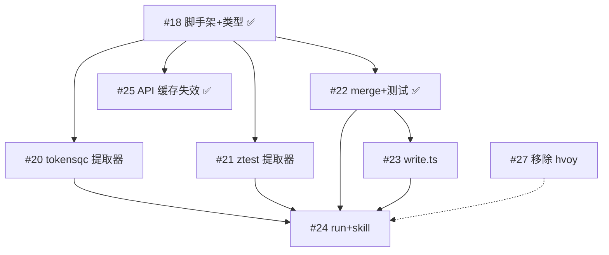

# pazi 开发计划

> 2026-06-22 更新：hvoy.ai 移除，tokensqc+ztest 并行化。详见 [#17 调查汇总](https://github.com/lvshiwei66/tokenmofang/issues/17#issuecomment-4764213627)。

## 数据源

| 源 | 角色 | 提取方式 | 提供字段 |
|----|------|----------|----------|
| tokensqc.com | 元数据源 | fetch（列表 API + SSR 详情页），**无需 Playwright** | name, intro, urls, tags, website, models |
| ztest.ai | 性能源 | Playwright（首页表格 + SPA 详情页） | latency, price, models+性能, 在线率 |

两个提取器**互不依赖**，提取方式不同（fetch vs Playwright），可并行开发和执行。

~~hvoy.ai~~ — 已移除（数据质量不足，见 #27）

## 依赖图

## 三波推进

### Wave 1 — 基础就绪，提取器并行

#18、#22、#25 已完成。两个提取器互不依赖，可同时开：

| Issue | 内容 | 前置 |
|-------|------|------|
| **#20** | tokensqc.com 提取器（fetch，无 Playwright） | #18 |
| **#21** | ztest.ai 提取器（Playwright） | #18 |
| **#27** | 移除 hvoy.ai（独立小任务） | — |

### Wave 2 — 提取器就绪后

| Issue | 内容 | 前置 |
|-------|------|------|
| **#23** | write.ts | #22（merge 数据契约就绪） |

### Wave 3 — 全部就绪收尾

| Issue | 内容 | 前置 |
|-------|------|------|
| **#24** | run.ts + SKILL.md | #20, #21, #22, #23 |

## 跨源去重策略（v1）

merge.ts 双键匹配：

1. **主键**：name 经 NFKC → 小写 → 去空白 归一化
2. **辅助键**：从 `urls.default` 提取域名

合并逻辑：name 匹配 **OR** domain 匹配 → 同一 provider。

## merge 字段优先级

| 字段 | 优先源 | 冲突策略 |
|------|--------|----------|
| name | tokensqc | 业务名更规范 |
| intro | tokensqc | 独有 |
| website | tokensqc | 独有 |
| urls | tokensqc | 多协议 URL 精确 |
| tags | tokensqc + ztest 并集 | 并集去重 |
| latency | ztest | 实测秒数（→ms 转换） |
| price | ztest | ¥/1M tokens |
| models | 并集 | tokensqc 有协议标注，ztest 有性能数据 |
| tokensPerSecond | 无 | 始终 null，留待 CLI `tmf test` |

## 关键约束

- **提取器并行**：tokensqc（fetch）和 ztest（Playwright）互不依赖，可同时开发和运行
- **merge 独立**：纯函数，不依赖任何提取器实现
- **API 缓存独立**：仅在 `code/api/` 内修改，和 pazi 所有模块可并行
- **write.ts 等 merge 契约**：不需要提取器就绪，只需要 `MergedResult` 类型定义
- **run.ts 最后**：需要所有模块就绪后才能集成
- **tokensPerSecond**：提取器不采集，null，由 CLI `tmf test` 命令在实际环境中测量后回填
