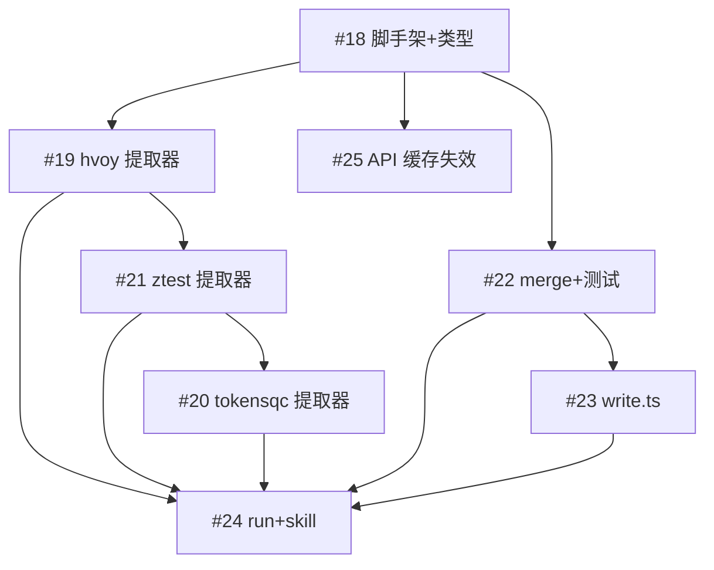

# pazi 开发计划

## 依赖图

## 四波推进

### Wave 1 — 基础就绪后并行

| Issue | 内容 | 前置 |
|-------|------|------|
| **#18** | pazi 脚手架 + 类型定义 | — |

#18 完成后，三个模块互不依赖，可并行：

| Issue | 内容 | 前置 |
|-------|------|------|
| **#19** | hvoy.ai 提取器 | #18 |
| **#22** | merge.ts + 单元测试 | #18 |
| **#25** | API 缓存失效端点 | #18（独立，在 code/api 改） |

### Wave 2 — hvoy + merge 就绪后并行

| Issue | 内容 | 前置 |
|-------|------|------|
| **#21** | ztest.ai 提取器 | #19（hvoy 完成后参考其模式） |
| **#23** | write.ts | #22（merge 数据契约就绪） |

### Wave 3 — ztest 就绪

| Issue | 内容 | 前置 |
|-------|------|------|
| **#20** | tokensqc.com 提取器 | #21（ztest 完成后参考累积模式） |

### Wave 4 — 全部就绪收尾

| Issue | 内容 | 前置 |
|-------|------|------|
| **#24** | run.ts + SKILL.md | #19, #21, #20, #22, #23 |

## 关键约束

- **提取器串行**：hvoy → ztest → tokensqc。每个提取器完成后，后续提取器可复用 Playwright 配置模式和错误处理模式
- **merge 独立**：纯函数，不依赖任何提取器实现。和 hvoy 可并行开发
- **API 缓存独立**：仅在 `code/api/` 内修改，和 pazi 所有模块可并行
- **write.ts 等 merge 契约**：不需要提取器就绪，只需要 `MergedResult` 类型定义
- **run.ts 最后**：需要所有模块就绪后才能集成

